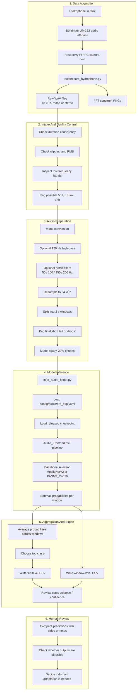

# U-FFIA Hydrophone Pipeline

This repository is a publishable working copy of the original U-FFIA codebase, adapted for our hydrophone-based experiments. The goal is pragmatic: take raw hydrophone captures, clean obvious electrical hum, convert them into model-ready audio windows, run the released U-FFIA audio checkpoints, and export per-file and per-window predictions for review.

## Links

- This repository: https://github.com/adzetto/u-ffia-hydrophone-pipeline
- Original U-FFIA repository: https://github.com/FishMaster93/U-FFIA
- Paper: https://arxiv.org/abs/2309.05058
- Paper PDF: https://arxiv.org/pdf/2309.05058.pdf
- Demo page: https://fishmaster93.github.io/UFFIA_demopage/
- Pretrained weights (Google Drive): https://drive.google.com/drive/folders/1fh-Lo3S7-aTgfPni5-IeG5_-P7MBKBfL?usp=drive_link
- AV-FFIA dataset (Zenodo): https://zenodo.org/records/11059975
- Our hydrophone data (Google Drive): https://drive.google.com/drive/folders/1qVZvUsLJxGaPP1cPbR4LjEqP2VsjgzeT?usp=drive_link

## What The Model Does

U-FFIA is a fish feeding intensity assessment model. The audio branch predicts one of four classes:

- `none`
- `strong`
- `medium`
- `weak`

In the original project, the full framework supports audio, video, and audio-visual fusion. This repo focuses on the audio side because that is the part we can drive directly from hydrophone recordings.

## What We Added

- `infer_audio_folder.py`
  - Folder-level inference for local `.wav` files
  - Auto-detection for the released audio checkpoints
  - Optional hydrophone-oriented preprocessing during inference
- `tools/preprocess_hydrophone_audio.py`
  - Offline conversion of raw hydrophone recordings into `64 kHz`, mono, `2 s` chunks
  - Optional high-pass and notch filtering
- `tools/record_hydrophone.py`
  - Simple Raspberry Pi / UMC22 capture utility for raw hydrophone clips and FFT snapshots
- `tools/plot_inference_results.py`
  - Matplotlib summary plots for file-level and window-level inference outputs
- Expanded documentation for setup, known caveats, and the end-to-end workflow

## Current Caveats

- The released audio configs are built around `64 kHz` and `2 second` clips.
- Our hydrophone recordings were captured at `48 kHz`, and many raw clips have very low energy.
- We observed clear `~50 Hz` / `~150 Hz` electrical hum in part of the hydrophone data.
- On our current hydrophone recordings, the released checkpoints are overconfident and tend to collapse into a single class. This means the pipeline runs, but the outputs should be treated as exploratory rather than validated.

## Our Data

Our working hydrophone dataset is stored separately from the codebase and can be downloaded here:

- https://drive.google.com/drive/folders/1qVZvUsLJxGaPP1cPbR4LjEqP2VsjgzeT?usp=drive_link

This repo assumes those recordings are local during preprocessing and inference, but the raw data itself is not committed into Git.

## Pipeline



## Quick Start

1. Create the environment from `environment.yml`, or use a Python environment with `torch`, `omegaconf`, `librosa`, `soundfile`, and `torchlibrosa`.
2. Download the released weights from Google Drive.
3. Place the weights under:

```text
pretrained_models/
  audio-visual_pretrainedmodel/
    audio_best.pt
  PANNs/
    CNN10_audio_best.pt
```

4. Run offline preprocessing if you want model-shaped windows on disk:

```bash
python tools/preprocess_hydrophone_audio.py path/to/raw_hydrophone_wavs path/to/processed_chunks
```

5. Run inference directly on raw or preprocessed audio:

```bash
python infer_audio_folder.py path/to/audio_folder --output-csv results.csv --window-csv window_results.csv
```

6. For hydrophone recordings with likely electrical hum, use the built-in preprocessing profile:

```bash
python infer_audio_folder.py path/to/audio_folder \
  --preprocess-profile hydrophone \
  --output-csv results.csv \
  --window-csv window_results.csv
```

## Example Commands

Preprocess a folder into model-ready chunks:

```bash
python tools/preprocess_hydrophone_audio.py PROJE1/hidrofon outputs/preprocessed_hidrofon
```

Inference with the default released audio checkpoint:

```bash
python infer_audio_folder.py outputs/preprocessed_hidrofon --output-csv outputs/hidrofon_results.csv
```

Inference with the PANNs checkpoint:

```bash
python infer_audio_folder.py outputs/preprocessed_hidrofon \
  --checkpoint pretrained_models/PANNs/CNN10_audio_best.pt \
  --output-csv outputs/hidrofon_panns_results.csv
```

Record a fresh hydrophone clip on the acquisition machine:

```bash
python tools/record_hydrophone.py --duration 10 --output-dir raw_capture
```

Generate a matplotlib summary from an inference CSV:

```bash
python tools/plot_inference_results.py results.csv --window-csv window_results.csv --output summary.png
```

## Repository Layout

- `config/`, `dataset/`, `models/`, `tasks/`
  - Original U-FFIA training and model code
- `infer_audio_folder.py`
  - File and folder inference entry point for audio-only experiments
- `tools/preprocess_hydrophone_audio.py`
  - Offline hydrophone cleanup and chunk export
- `tools/record_hydrophone.py`
  - Basic raw hydrophone capture helper
- `tools/plot_inference_results.py`
  - Converts inference CSV outputs into reviewable matplotlib summaries
- `results/`
  - Local experiment outputs, plots, and result notes

## Current Results

The current hydrophone experiment outputs are stored under `results/hidrofon/`.

- `mobilenet_hydrophone_summary.png`
  - File-level and window-level summary for the released MobileNetV2-based checkpoint
- `panns_hydrophone_summary.png`
  - File-level and window-level summary for the released PANNs CNN10 checkpoint
- `hydrophone_model_comparison.png`
  - Direct comparison of class counts, per-file labels, and confidence behavior

In short, the MobileNetV2 checkpoint produces some variation but still leans heavily toward `weak`, while the PANNs CNN10 checkpoint collapses to `strong` for every tested hydrophone file.

## Notes On Validation

The pipeline is operational, but it is not yet validated for our hydrophone domain. The current outputs should be treated as:

- a reproducible demo pipeline
- a way to inspect class probabilities and failure modes
- a baseline before any domain adaptation or threshold calibration

If reliable deployment is the goal, the next step is to build a labeled hydrophone validation set and compare predictions against ground truth rather than relying only on confidence scores.
