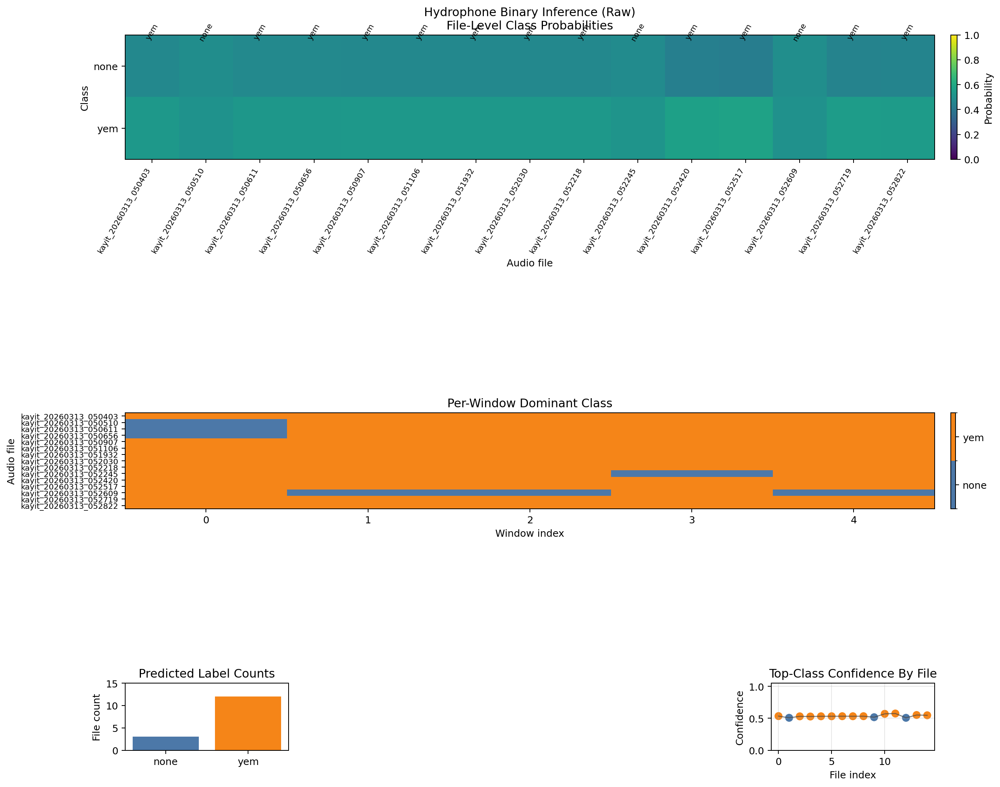
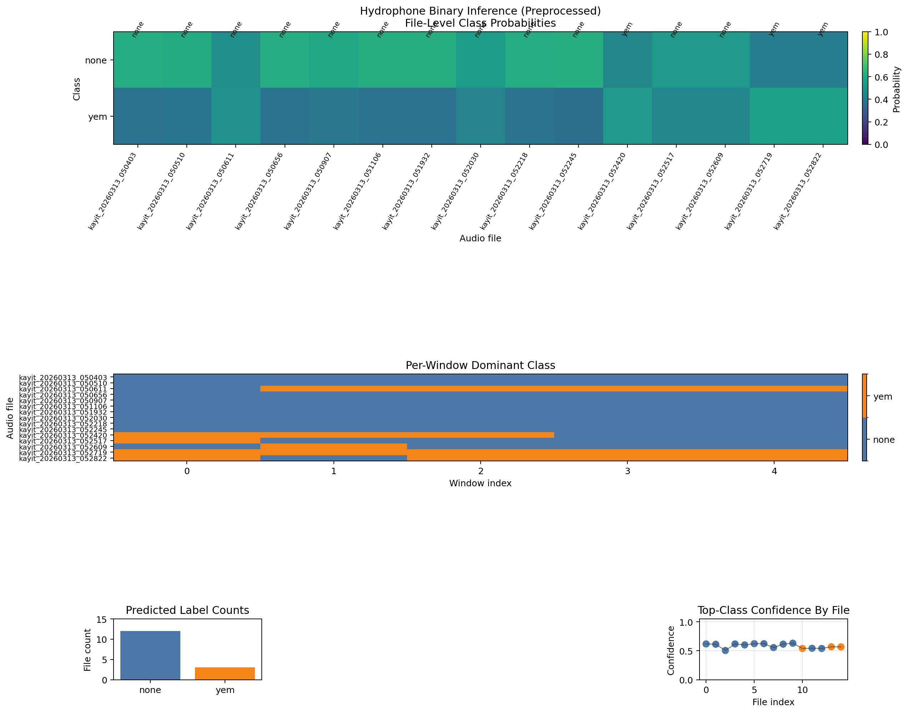

# U-FFIA Hydrophone Pipeline

Hydrophone-oriented evaluation pipeline built on top of U-FFIA. The current recommended path is `MobileNetV2 binary none/yem fine-tune + hydrophone preprocess + hydrophone_v1 adaptation`.

## Links

- Repository: https://github.com/adzetto/u-ffia-hydrophone-pipeline
- Paper: https://arxiv.org/abs/2309.05058
- Original U-FFIA repo: https://github.com/FishMaster93/U-FFIA
- Released weights: https://drive.google.com/drive/folders/1fh-Lo3S7-aTgfPni5-IeG5_-P7MBKBfL?usp=drive_link
- Our hydrophone data: https://drive.google.com/drive/folders/1qVZvUsLJxGaPP1cPbR4LjEqP2VsjgzeT?usp=drive_link

## Results Snapshot







## Short Findings

| Item | Result |
| --- | --- |
| Raw-data structure | `15` files, all `48 kHz`, mono, `10 s`, no clipping |
| Raw-data issue | `10/15` files are very low energy, `5/15` are strongly `50 Hz` hum-heavy |
| Updated local labels | `none = yemleme yok`, `yem = yemleme var` |
| Binary fine-tune data | `voice_none1/2` and `voice_yem1/2`, total `1665` clips |
| Best binary checkpoint | `results/finetune_binary_none_yem/hydrophone_source_e8_thr/audio_binary_best.pt` |
| Binary test result | Accuracy `0.724`, macro-F1 `0.677`, `yem` F1 `0.555` |
| Recommended profile | `binary MobileNetV2 + hydrophone preprocess + hydrophone_v1 adaptation` |
| Hydrophone binary output | Raw run: `12 yem / 3 none`; preprocessed run: `12 none / 3 yem` |
| Local validation | 4-way local projection maps the first `10` hydrophone files to `voice2`-like and the last `5` to `voice`-like |
| PANNs CNN10 | Still collapsed and not recommended on this dataset |

## Docs

- Detailed pipeline and execution tables: [docs/PIPELINE.md](docs/PIPELINE.md)
- Detailed results, markdown tables, adapter report, and plot references: [docs/RESULTS.md](docs/RESULTS.md)

## Quick Start

```bash
python tools/finetune_binary_audio.py --negative-dir PROJE1/voice_none1 --negative-dir PROJE1/voice_none2 --positive-dir PROJE1/voice_yem1 --positive-dir PROJE1/voice_yem2 --output-dir results/finetune_binary_none_yem/hydrophone_source_e8_thr --epochs 8 --batch-size 32 --preprocess-profile hydrophone --adaptation-profile hydrophone_v1
python infer_audio_folder.py PROJE1/hidrofon --config config/audio/exp_binary_none_yem.yaml --checkpoint results/finetune_binary_none_yem/hydrophone_source_e8_thr/audio_binary_best.pt --preprocess-profile hydrophone --adaptation-profile hydrophone_v1 --output-csv results/finetune_binary_none_yem/hydrophone_source_e8_thr/hidrofon_binary_hydrophone.csv
```
