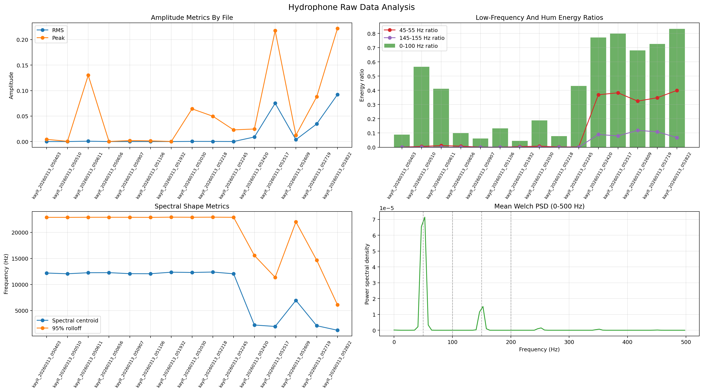
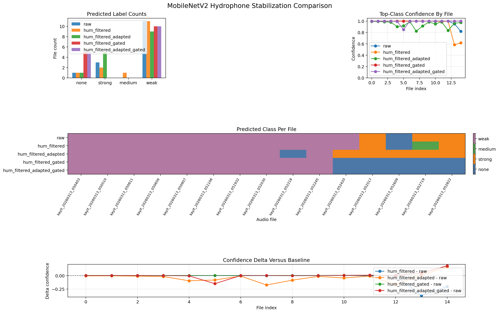
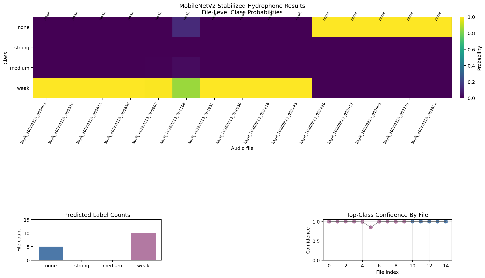

# U-FFIA Hydrophone Pipeline

Hydrophone-oriented evaluation pipeline built on top of U-FFIA. The current recommended path is `MobileNetV2 + hydrophone preprocess + local binary gate`.

## Links

- Repository: https://github.com/adzetto/u-ffia-hydrophone-pipeline
- Paper: https://arxiv.org/abs/2309.05058
- Original U-FFIA repo: https://github.com/FishMaster93/U-FFIA
- Released weights: https://drive.google.com/drive/folders/1fh-Lo3S7-aTgfPni5-IeG5_-P7MBKBfL?usp=drive_link
- Our hydrophone data: https://drive.google.com/drive/folders/1qVZvUsLJxGaPP1cPbR4LjEqP2VsjgzeT?usp=drive_link

## Results Snapshot







## Short Findings

| Item | Result |
| --- | --- |
| Raw-data structure | `15` files, all `48 kHz`, mono, `10 s`, no clipping |
| Raw-data issue | `10/15` files are very low energy, `5/15` are strongly `50 Hz` hum-heavy |
| Recommended profile | `MobileNetV2 + hydrophone preprocess + hydrophone_v1 adaptation + binary gate` |
| Stabilized output | `10` files `weak`, `5` files `none` |
| Local validation | 4-way local projection maps the first `10` hydrophone files to `voice2`-like and the last `5` to `voice`-like |
| PANNs CNN10 | Still collapsed and not recommended on this dataset |

## Docs

- Detailed pipeline and execution tables: [docs/PIPELINE.md](docs/PIPELINE.md)
- Detailed results, markdown tables, adapter report, and plot references: [docs/RESULTS.md](docs/RESULTS.md)

## Quick Start

```bash
python tools/train_hydrophone_binary_adapter.py --positive-dir PROJE1/voice_yem --negative-dir PROJE1/voice --output-model results/adapter/local_binary_gate.joblib --preprocess-profile hydrophone
python infer_audio_folder.py path/to/audio_folder --preprocess-profile hydrophone --adaptation-profile hydrophone_v1 --binary-adapter-model results/adapter/local_binary_gate.joblib --stabilization-profile binary_gate --output-csv stabilized.csv
```
