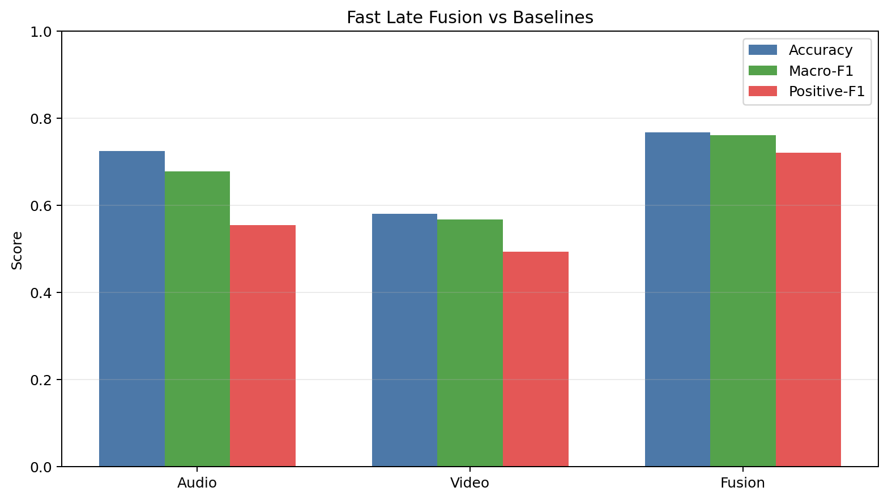

# Fast Late Fusion

This document records the practical local audio+video path that was chosen after the end-to-end AV fine-tune route proved too slow for iterative work on this machine.

## Why This Path

- Audio-only fine-tune was already usable but not strong enough on its own.
- Released video-only inference was informative but inconsistent, especially on `video_yem2`.
- A lightweight late-fusion model trained on existing audio and video prediction CSVs improved reliability without requiring hours of GPU retraining.

## Label Note

The local labels were updated as:

- `none`: no feeding was given
- `yem`: feeding was given

There is one important nuance:

- `yem2` is a weak-positive source. Fish ate less in this session and feeding happened later, so the positive signal is present but weaker than `yem1`.

To reflect this, the fast fusion run uses:

- `voice_yem2 = 0.8` sample weight

## Recommended Command

```bash
python tools/train_fast_late_fusion.py --source-weight voice_yem2=0.8
```

## Result Figure



## Result Summary

| Path | Accuracy | Macro-F1 | Positive-F1 | Notes |
| --- | ---: | ---: | ---: | --- |
| Audio-only binary fine-tune | `0.724` | `0.677` | `0.555` | Best previous audio path |
| Video feed-like proxy | `0.580` | `0.567` | `0.493` | Uses tuned threshold on `1 - score_none` |
| Fast late fusion | `0.768` | `0.761` | `0.721` | Current best practical local AV path |

## Best Fusion Model

| Item | Value |
| --- | --- |
| Model | `random_forest` |
| Validation threshold | `0.51` |
| Validation macro-F1 | `0.7965` |
| Test confusion | `[[117, 33], [25, 75]]` |

## Artifacts

| Artifact | Path |
| --- | --- |
| Summary | `results/fusion_fast/summary.json` |
| Search log | `results/fusion_fast/search.json` |
| Test predictions | `results/fusion_fast/test_predictions.csv` |
| Serialized best model | `results/fusion_fast/best_model.joblib` |
| Comparison plot | `results/fusion_fast/comparison.png` |
