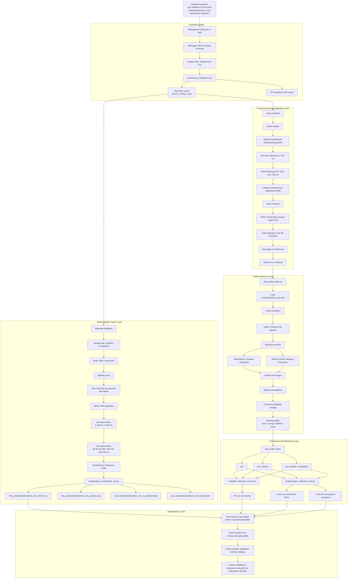
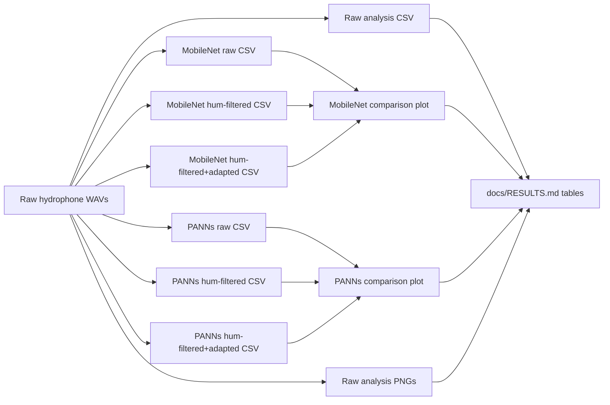

# Detailed Pipeline

This document expands the short repository README and records the execution structure used in the hydrophone experiments.

## Figure 1. End-to-End Hydrophone Execution Flow

## Figure 2. Artifact Dependency Graph

## Execution Table

| Stage | Script / CLI | Main input | Main operations | Output artifacts |
| --- | --- | --- | --- | --- |
| Acquisition | `tools/record_hydrophone.py` | Live hydrophone stream | Record PCM16 wav, save FFT snapshot | raw `.wav`, spectrum `.png` |
| Raw analysis | `tools/analyze_hydrophone_raw.py` | Raw wav folder | Metadata, amplitude, Welch PSD, hum-band ratios, joined predictions | metrics `.csv`, analysis `.png`, summary `.md` |
| Preprocess only | `tools/preprocess_hydrophone_audio.py` | Raw wav folder | high-pass, notch, resample, chunking | processed `.wav` chunks |
| Inference | `infer_audio_folder.py` | Raw or processed wav folder | frontend, backbone, softmax, file aggregation | prediction `.csv` |
| Single-run plotting | `tools/plot_inference_results.py` | prediction `.csv` | probability heatmap, count plots | summary `.png` |
| Multi-run comparison | `tools/compare_inference_runs.py` | multiple prediction `.csv` files | cross-run count, class, confidence comparison | comparison `.png`, comparison `.md` |

## Run Profile Table

| Profile | Preprocess profile | Adaptation profile | Intended purpose |
| --- | --- | --- | --- |
| `raw` | `none` | `none` | Baseline run on untreated hydrophone recordings |
| `hum_filtered` | `hydrophone` | `none` | Test whether electrical hum suppression changes model outputs |
| `hum_filtered_adapted` | `hydrophone` | `hydrophone_v1` | Test whether simple unsupervised RMS adaptation reduces domain mismatch |

## Output Artifact Table

| Artifact group | Location |
| --- | --- |
| Raw analysis figures and tables | `results/hidrofon/raw_analysis/` |
| MobileNet comparison runs | `results/hidrofon/comparisons/mobilenet/` |
| PANNs comparison runs | `results/hidrofon/comparisons/panns/` |
| Short results overview | `docs/RESULTS.md` |
