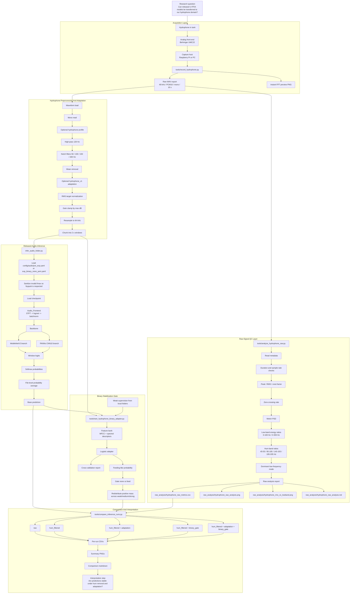
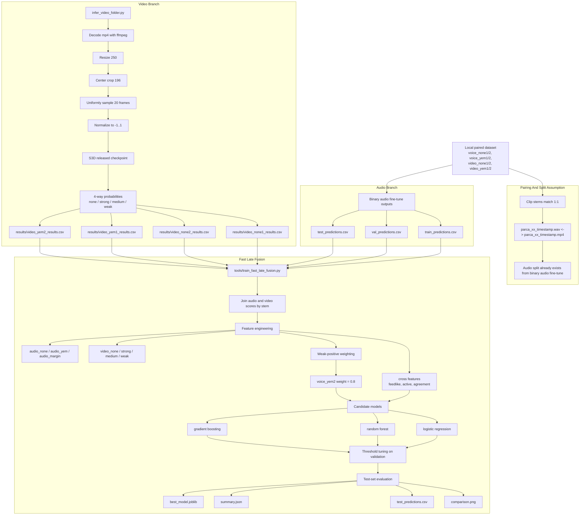
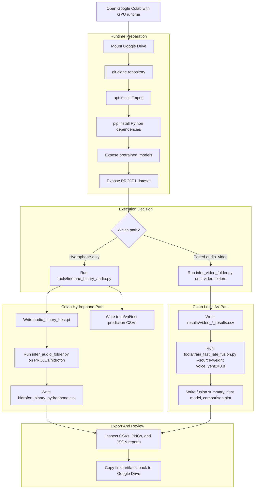
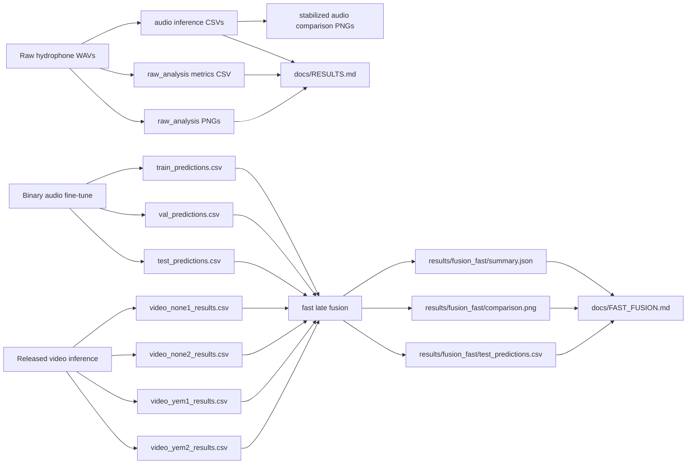

# Detailed Pipeline

This document expands the short repository README and records the execution structure used across the hydrophone, local video, and fast late-fusion experiments.

## Figure 1. Hydrophone Audio Stabilization Pipeline

## Figure 2. Local Video Evaluation And Fast Late Fusion Pipeline

## Figure 3. Google Colab Execution Flow

## Figure 4. Artifact Dependency Graph

## Execution Table

| Stage | Script / CLI | Main input | Main operations | Output artifacts |
| --- | --- | --- | --- | --- |
| Acquisition | `tools/record_hydrophone.py` | Live hydrophone stream | Record PCM16 wav, save FFT snapshot | raw `.wav`, spectrum `.png` |
| Raw analysis | `tools/analyze_hydrophone_raw.py` | Raw wav folder | Metadata, RMS, PSD, hum-band ratios, signal report | metrics `.csv`, analysis `.png`, summary `.md` |
| Hydrophone preprocessing | `tools/preprocess_hydrophone_audio.py` | Raw wav folder | high-pass, notch, resample, chunking | processed `.wav` chunks |
| Audio inference | `infer_audio_folder.py` | Raw or processed wav folder | frontend, Nyquist-safe mel band sanitization, backbone, softmax, file aggregation | prediction `.csv` |
| Binary gate training | `tools/train_hydrophone_binary_adapter.py` | weakly labeled local folders | MFCC and spectral features, logistic regression, CV evaluation | adapter `.joblib`, report `.md`, report `.png` |
| Stabilized inference | `infer_audio_folder.py --binary-adapter-model ... --stabilization-profile binary_gate` | wav folder + adapter | base model plus binary feeding gate | stabilized prediction `.csv` |
| Video inference | `infer_video_folder.py` | local `.mp4` folders | ffmpeg decode, resize, crop, frame sampling, S3D inference | `video_*_results.csv` |
| Fast late fusion | `tools/train_fast_late_fusion.py` | audio prediction CSVs + video prediction CSVs | join by stem, feature engineering, source weighting, model selection, threshold tuning | best model `.joblib`, summary `.json`, predictions `.csv`, comparison `.png` |
| End-to-end AV fine-tune | `tools/finetune_binary_av.py` | paired local audio+video clips | slow direct AV training with released initialization | AV checkpoint and metrics |

## Run Profile Table

| Profile | Preprocess profile | Adaptation profile | Intended purpose |
| --- | --- | --- | --- |
| `raw` | `none` | `none` | Baseline run on untreated hydrophone recordings |
| `hum_filtered` | `hydrophone` | `none` | Test whether electrical hum suppression changes model outputs |
| `hum_filtered_adapted` | `hydrophone` | `hydrophone_v1` | Test whether simple unsupervised RMS adaptation reduces domain mismatch |
| `hum_filtered_gated` | `hydrophone` | `none` | Use local binary gate to suppress unstable nonfeeding false positives |
| `hum_filtered_adapted_gated` | `hydrophone` | `hydrophone_v1` | Stabilized path combining local gate with amplitude adaptation |
| `video_released_eval` | N/A | N/A | Measure transferred video-only behaviour on local clips |
| `fast_late_fusion` | audio hydrophone profile optional | audio hydrophone_v1 optional | Combine local audio and video evidence with a cheap secondary model |

## Colab-Oriented Execution Table

| Colab step | Main command | Expected duration | Main artifact |
| --- | --- | --- | --- |
| Environment bootstrap | `apt-get install ffmpeg` and `pip install ...` | short | ready runtime |
| Audio fine-tune | `python tools/finetune_binary_audio.py ...` | medium | `audio_binary_best.pt` |
| Hydrophone inference | `python infer_audio_folder.py ...` | short | hydrophone prediction CSV |
| Video released inference | `python infer_video_folder.py ...` on 4 folders | medium to long | `results/video_*_results.csv` |
| Fast late fusion | `python tools/train_fast_late_fusion.py --source-weight voice_yem2=0.8` | very short | `results/fusion_fast/*` |

## Output Artifact Table

| Artifact group | Location |
| --- | --- |
| Raw analysis figures and tables | `results/hidrofon/raw_analysis/` |
| Binary adapter artifacts | `results/adapter/` |
| MobileNet comparison runs | `results/hidrofon/comparisons/mobilenet/` |
| PANNs comparison runs | `results/hidrofon/comparisons/panns/` |
| Binary audio fine-tune outputs | `results/finetune_binary_none_yem/` |
| Video evaluation outputs | `results/video_*_results.csv` and `results/video_eval/` |
| Fast late-fusion outputs | `results/fusion_fast/` |
| Short results overview | `docs/RESULTS.md` |
| Fast fusion detail | `docs/FAST_FUSION.md` |
| Colab guide | `docs/COLAB.md` |
