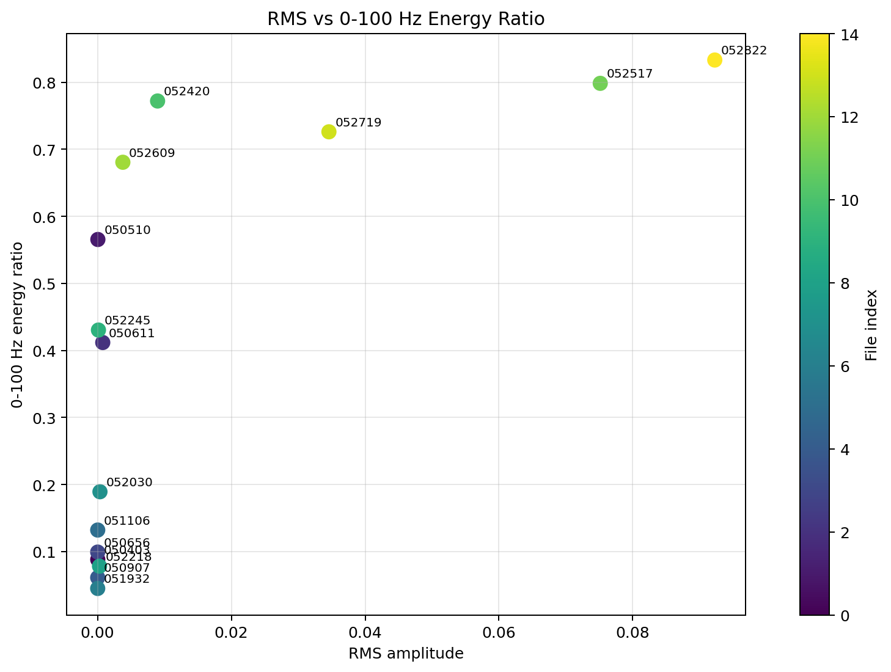
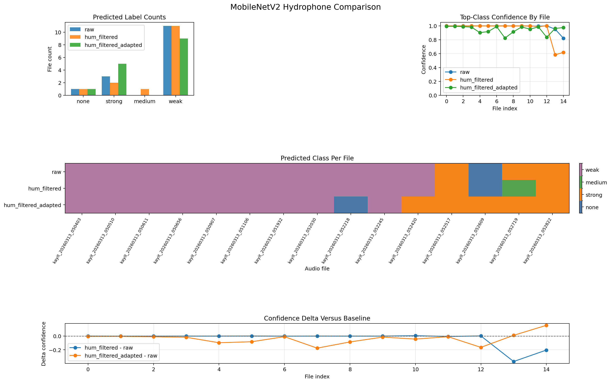
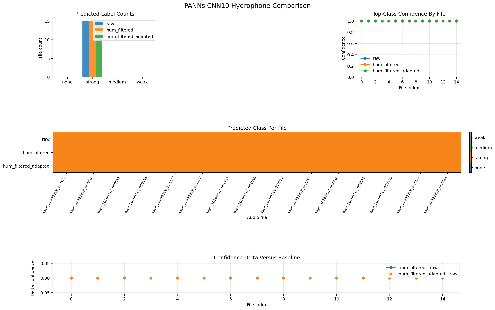

# Hydrophone Results

This document collects the raw-data analysis, model comparison plots, and the per-file prediction table.

## Raw Data Analysis Figures

## Model Comparison Figures

## Execution Summary

| Model | Run | Predicted counts | Mean confidence | File-level label changes vs raw |
| --- | --- | --- | --- | --- |
| MobileNetV2 | `raw` | `{'weak': 11, 'strong': 3, 'none': 1}` | `0.9833` | baseline |
| MobileNetV2 | `hum_filtered` | `{'weak': 11, 'strong': 2, 'none': 1, 'medium': 1}` | `0.9441` | `1` file changed |
| MobileNetV2 | `hum_filtered_adapted` | `{'weak': 9, 'none': 1, 'strong': 5}` | `0.9459` | `3` files changed |
| PANNs CNN10 | `raw` | `{'strong': 15}` | `1.0000` | baseline |
| PANNs CNN10 | `hum_filtered` | `{'strong': 15}` | `1.0000` | `0` files changed |
| PANNs CNN10 | `hum_filtered_adapted` | `{'strong': 15}` | `1.0000` | `0` files changed |

## Raw Data Summary

| Metric | Value |
| --- | --- |
| File count | `15` |
| Sample rate | `48 kHz` |
| Duration | `10.0 s` each |
| Channel count | mono |
| Mean RMS | `0.014437` |
| Median RMS | `0.000301` |
| Files with RMS < `0.001` | `10/15` |
| Files with strong 50 Hz ratio >= `0.1` | `5/15` |

## Per-File Comparison Table

| File | Raw profile | RMS | MobileNet raw | MobileNet hum filtered | MobileNet hum filtered + adapted | PANNs all runs |
| --- | --- | ---: | --- | --- | --- | --- |
| 050403 | sub-10Hz / low-energy | 3.9e-05 | weak | weak | weak | strong |
| 050510 | sub-10Hz / low-energy | 5.4e-05 | weak | weak | weak | strong |
| 050611 | sub-10Hz / low-energy | 0.000783 | weak | weak | weak | strong |
| 050656 | sub-10Hz / low-energy | 2.9e-05 | weak | weak | weak | strong |
| 050907 | sub-10Hz / low-energy | 3.2e-05 | weak | weak | weak | strong |
| 051106 | sub-10Hz / low-energy | 3.2e-05 | weak | weak | weak | strong |
| 051932 | sub-10Hz / low-energy | 2.9e-05 | weak | weak | weak | strong |
| 052030 | sub-10Hz / low-energy | 0.000367 | weak | weak | weak | strong |
| 052218 | sub-10Hz / low-energy | 0.000301 | weak | weak | none | strong |
| 052245 | sub-10Hz / low-energy | 0.000142 | weak | weak | weak | strong |
| 052420 | 50Hz hum-heavy | 0.008980 | weak | weak | strong | strong |
| 052517 | 50Hz hum-heavy | 0.075139 | strong | strong | strong | strong |
| 052609 | 50Hz hum-heavy | 0.003788 | none | none | strong | strong |
| 052719 | 50Hz hum-heavy | 0.034587 | strong | medium | strong | strong |
| 052822 | 50Hz hum-heavy | 0.092256 | strong | strong | strong | strong |

## Interpretation

| Observation | Interpretation |
| --- | --- |
| First `10` files are mostly sub-10 Hz and low-energy | The baseline data are technically valid but acoustically weak for direct transfer from the released model domain |
| Last `5` files are hum-heavy around `~50 Hz` with visible `~150 Hz` content | Electrical or acquisition-chain contamination is plausible and measurable |
| MobileNetV2 changes under filtering and adaptation | This branch is at least somewhat sensitive to hydrophone preprocessing, but it is not stable enough to call validated |
| PANNs CNN10 never changes | This branch is effectively collapsed on the current hydrophone dataset |

## Artifact References

| Artifact | Path |
| --- | --- |
| Raw metrics CSV | `results/hidrofon/raw_analysis/hydrophone_raw_metrics.csv` |
| Raw analysis markdown | `results/hidrofon/raw_analysis/hydrophone_raw_analysis.md` |
| MobileNet comparison markdown | `results/hidrofon/comparisons/mobilenet/comparison.md` |
| PANNs comparison markdown | `results/hidrofon/comparisons/panns/comparison.md` |
