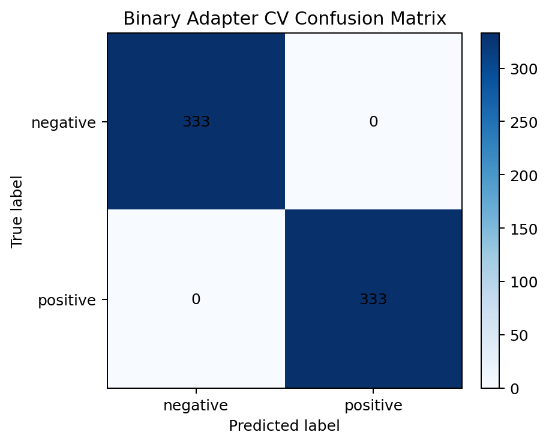

# Hydrophone Results

This document collects the raw-data analysis, adapter training result, model comparison plots, and the per-file prediction table.

## Raw Data Analysis Figures

## Model Comparison Figures

## Binary Adapter Training

The local binary adapter was trained with:

- Positive weak label folder: `PROJE1/voice_yem`
- Negative weak label folder: `PROJE1/voice`
- Preprocess profile: `hydrophone`
- Adaptation profile: `hydrophone_v1`
- Cross-validation result: `accuracy = 1.0000`, `f1 = 1.0000`

## Local Validation

- Binary-gated inference on `PROJE1/voice` produces `333/333` files as `none`.
- Binary-gated inference on `PROJE1/voice_yem` still produces a mixed positive-side output: `235` `strong`, `97` `none`, `1` `weak`.
- This means the released U-FFIA checkpoint is still not reliable for fine-grained positive-class transfer, even after preprocessing and gating.
- An exploratory 4-way local feature classifier over `voice`, `voice2`, `voice_yem`, and `voice1` reached `accuracy = 0.9970 +/- 0.0033` in cross-validation.
- That local 4-way projection places the first `10` hydrophone recordings in the `voice2` cluster and the last `5` hum-heavy recordings in the `voice` cluster.
- Interpreting `voice` as `none-like` and `voice2` as `weak-like` supports the current recommended hydrophone split of `10 weak / 5 none`.

## Execution Summary

| Model | Run | Predicted counts | Mean confidence | File-level label changes vs raw |
| --- | --- | --- | --- | --- |
| MobileNetV2 | `raw` | `{'weak': 11, 'strong': 3, 'none': 1}` | `0.9833` | baseline |
| MobileNetV2 | `hum_filtered` | `{'weak': 11, 'strong': 2, 'none': 1, 'medium': 1}` | `0.9441` | `1` file changed |
| MobileNetV2 | `hum_filtered_adapted` | `{'weak': 9, 'none': 1, 'strong': 5}` | `0.9459` | `3` files changed |
| MobileNetV2 | `hum_filtered_gated` | `{'weak': 10, 'none': 5}` | `1.0000` | `4` files changed |
| MobileNetV2 | `hum_filtered_adapted_gated` | `{'weak': 10, 'none': 5}` | `0.9889` | `4` files changed |
| PANNs CNN10 | `raw` | `{'strong': 15}` | `1.0000` | baseline |
| PANNs CNN10 | `hum_filtered` | `{'strong': 15}` | `1.0000` | `0` files changed |
| PANNs CNN10 | `hum_filtered_adapted` | `{'strong': 15}` | `1.0000` | `0` files changed |

## Raw Data Summary

| Metric | Value |
| --- | --- |
| File count | `15` |
| Sample rate | `48 kHz` |
| Duration | `10.0 s` each |
| Channel count | mono |
| Mean RMS | `0.014437` |
| Median RMS | `0.000301` |
| Files with RMS < `0.001` | `10/15` |
| Files with strong 50 Hz ratio >= `0.1` | `5/15` |

## Per-File Comparison Table

| File | Raw profile | RMS | MobileNet raw | MobileNet hum filtered | MobileNet hum filtered + adapted | Stabilized MobileNet | PANNs all runs |
| --- | --- | ---: | --- | --- | --- | --- | --- |
| 050403 | sub-10Hz / low-energy | 3.9e-05 | weak | weak | weak | weak | strong |
| 050510 | sub-10Hz / low-energy | 5.4e-05 | weak | weak | weak | weak | strong |
| 050611 | sub-10Hz / low-energy | 0.000783 | weak | weak | weak | weak | strong |
| 050656 | sub-10Hz / low-energy | 2.9e-05 | weak | weak | weak | weak | strong |
| 050907 | sub-10Hz / low-energy | 3.2e-05 | weak | weak | weak | weak | strong |
| 051106 | sub-10Hz / low-energy | 3.2e-05 | weak | weak | weak | weak | strong |
| 051932 | sub-10Hz / low-energy | 2.9e-05 | weak | weak | weak | weak | strong |
| 052030 | sub-10Hz / low-energy | 0.000367 | weak | weak | weak | weak | strong |
| 052218 | sub-10Hz / low-energy | 0.000301 | weak | weak | none | weak | strong |
| 052245 | sub-10Hz / low-energy | 0.000142 | weak | weak | weak | weak | strong |
| 052420 | 50Hz hum-heavy | 0.008980 | weak | weak | strong | none | strong |
| 052517 | 50Hz hum-heavy | 0.075139 | strong | strong | strong | none | strong |
| 052609 | 50Hz hum-heavy | 0.003788 | none | none | strong | none | strong |
| 052719 | 50Hz hum-heavy | 0.034587 | strong | medium | strong | none | strong |
| 052822 | 50Hz hum-heavy | 0.092256 | strong | strong | strong | none | strong |

## Interpretation

| Observation | Interpretation |
| --- | --- |
| First `10` files are mostly sub-10 Hz and low-energy | The baseline data are technically valid but acoustically weak for direct transfer from the released model domain |
| Last `5` files are hum-heavy around `~50 Hz` with visible `~150 Hz` content | Electrical or acquisition-chain contamination is plausible and measurable |
| MobileNetV2 changes under filtering and adaptation | This branch is sensitive to hydrophone preprocessing, but raw release outputs alone are not stable enough |
| Binary gate produces the same 10 weak / 5 none split under both filtered and filtered+adapted profiles | This is the most stable path currently available with local weak supervision |
| Local 4-way projection maps hydrophone to `voice2` for the first `10` files and `voice` for the last `5` | The stabilized split is supported by local-domain similarity, not only by the released model logits |
| PANNs CNN10 never changes | This branch is effectively collapsed on the current hydrophone dataset |

## Artifact References

| Artifact | Path |
| --- | --- |
| Raw metrics CSV | `results/hidrofon/raw_analysis/hydrophone_raw_metrics.csv` |
| Raw analysis markdown | `results/hidrofon/raw_analysis/hydrophone_raw_analysis.md` |
| Binary adapter report | `results/adapter/voice_vs_voice_yem_binary_adapter_hydrophone_v1.md` |
| Local validation note | `results/adapter/local_validation.md` |
| MobileNet comparison markdown | `results/hidrofon/comparisons/mobilenet/comparison.md` |
| MobileNet stabilized comparison markdown | `results/hidrofon/comparisons/mobilenet/comparison_stabilized.md` |
| PANNs comparison markdown | `results/hidrofon/comparisons/panns/comparison.md` |
